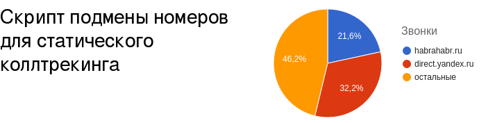

# Статический коллтрекинг



### Описание
Этот код подменяет номера телефонов на страницах сайта в зависимости от того, с какого сайта или с какими utm метками пришел посетитель на ваш сайт. Номера для подмены вы задаете самостоятельно. Важно, чтобы у вас была возможность получить статистику звонков на все ваши номера. Благодаря подмене номеров, по статистике звонков вы сможете определить какие источники траффика дают наибольшее количество звонков. 

### Особенности
 * Есть список предопределенных основных источников траффика (органика, соц.сети, контекст).
 * Умеет подменять заголовки и другой контент на странице.
 * Позволяет подменять несколько номеров одновременно.

### Установка
Сохраните скрипт sipuni-calltracking.js и подключите его на странице.
```html
<script src='/js/sipuni-calltracking.js'></script>
```

### Пример использования
Предположим, у нас на сайте отображатся два номера телефона, и нам нужно отследить трафик с Яндекс Директ и двух сайтов: habrahabr.ru и oborot.ru

Добавляем CSS классы ct_phone в элементах, где будет происходить подмена номеров:
```html
<div>Тел. 1: <span class="ct_phone1">+7 888 888-88-88</span></div>
```    

Настраиваем вызов скрипта подмены. 
 * В поле sources задаем правила определения источников трафика. Подробнее о настройке правил см. далее. 
 * В поле phones задаем названия источников трафика, и соответсвующие им номера телефонов. 
Вызов этого скрипта должен происходить после HTML элементов содержащих номера телефонов, или в событии готовности DOM модели.
```html
<script>
    sipuniCalltracking({
      sources: {
        'ydirect':{'utm_source': 'direct.yandex.ru'},
        'articles':{'ref':/(habrahabr|oborot\.ru)/ig}
      },
      phones: [
        {'src':'articles', 'phone':['+75555555555']},
        {'src':'ydirect', 'phone':['+73333333333']}
      ],
    });
</script>
```

### Оглавление
 * [Установка и настройка](doc/install.md)
 * [Настройка источников трафика](doc/sources.md)
 * [Отображение нескольких телефонов](doc/many-numbers.md)
 * [Подмена конента страницы](doc/subst-content.md)
 

[](http://calltracking.sipuni.com) 
 
